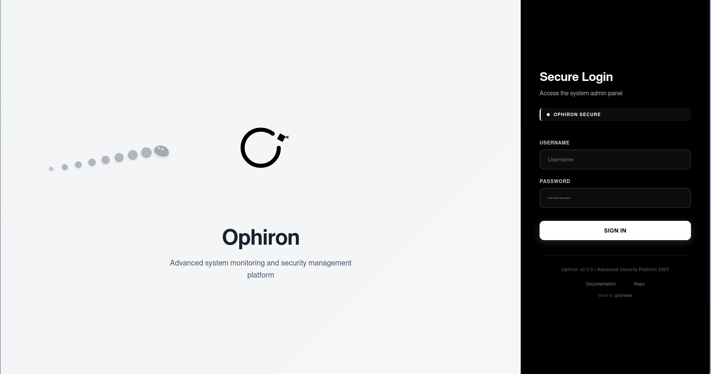
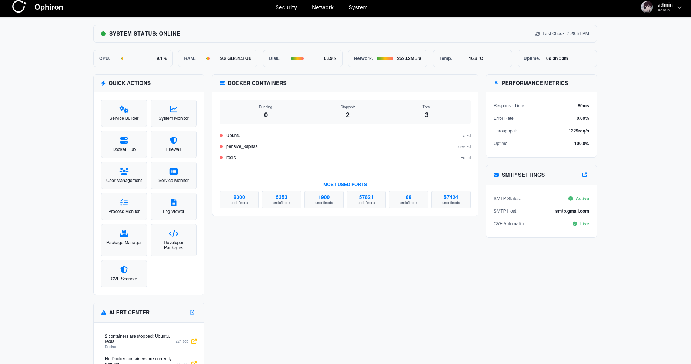
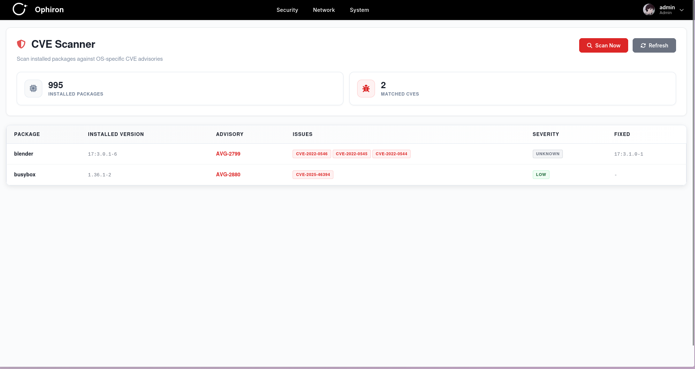
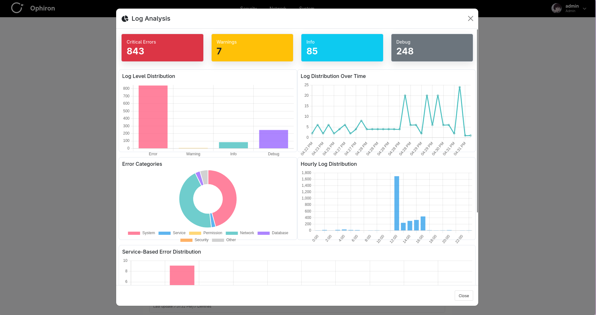
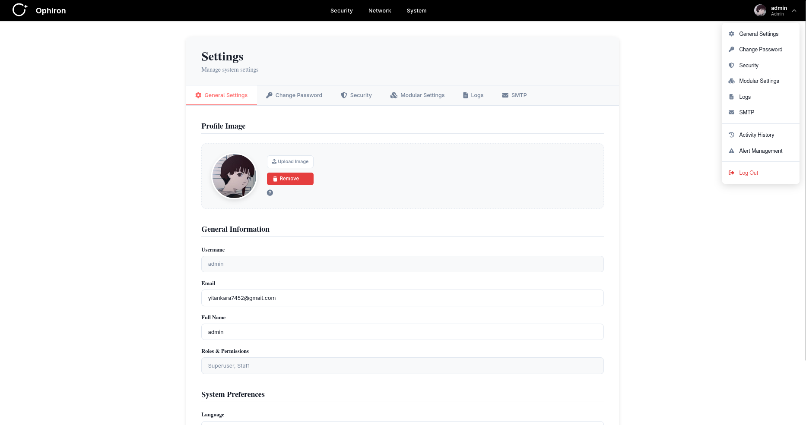

# Ophiron

Advanced System Monitoring and Security Management Platform

[Website](https://ophiron.glitchidea.com/) • [Report Issue](https://github.com/glitchidea/Ophiron/issues) • [Community](https://github.com/glitchidea/Ophiron/discussions)

 

Language / Dil / Sprache:
[Türkçe](MD-Document/README/README.tr.md) • [English](MD-Document/README/README.en.md) • [Deutsch](MD-Document/README/README.de.md)

## Overview

Ophiron is a lightweight web application that provides real-time monitoring, security scanning (CVE), service and log management on Linux servers. Select a language for details and installation.

## Key Features

- Real-time metrics and process/service monitoring (WebSocket)
- Security: CVE scanning for multiple distributions, package and firewall information
- Log analysis: Search/filter/export in syslog/journal and application logs
- Service builder: Templates and validations for systemd services
- Multilingual interface: Turkish, English, German

## Screenshots

### Login Page

### Dashboard

### CVE Scanner

### Application Logs

### Log Analysis

### Settings

## Getting Started

Select a language for installation and details:
- Türkçe: [README/README.tr.md](MD-Document/README/README.tr.md)
- English: [README/README.en.md](MD-Document/README/README.en.md)
- Deutsch: [README/README.de.md](MD-Document/README/README.de.md)

## 🔧 Plugin Development (SDK)

Want to develop your own plugin for Ophiron? Check out our comprehensive SDK documentation:

**SDK Documentation:**
-  Türkçe: [SDK Plugin Development Guide](MD-Document/SDK/SDK_PLUGIN_DEVELOPMENT.tr.md)
-  English: [SDK Plugin Development Guide](MD-Document/SDK/SDK_PLUGIN_DEVELOPMENT.en.md)
-  Deutsch: [SDK Plugin Development Guide](MD-Document/SDK/SDK_PLUGIN_DEVELOPMENT.de.md)

**Official Plugins:**
See [SDK_LIST.md](MD-Document/SDK_LIST.md) for a list of official plugins and their repositories.

## License and Commercial Use

This project is under a proprietary license. See the `LICENSE` file for details.

### ⚠️ Important Notice for Commercial/Enterprise Use

If you plan to use this project for **commercial purposes** or in an **enterprise environment**, **license acquisition and approval are mandatory** for the following scenarios:

- ✅ **Direct or indirect revenue** will be generated from this project
- ✅ Will be used in a **corporate/commercial** environment
- ✅ Will be offered **as a service** to customers
- ✅ Will be used as part of a **commercial product or service**

### 📧 Notification and Approval Process

If any of the above scenarios apply to you, you **must** send an email with the following information **before starting use**:

**Email Address:** **info@glitchidea.com**

**Required information in the email:**
- Company/Organization name
- Purpose and scope of use
- Expected number of users
- Duration of use
- Contact information

**Commercial/enterprise use without prior approval constitutes a license violation.**

### ✅ Personal/Research Use

No license requirement exists for personal projects, educational use, and open-source research projects.

**For detailed information:** [Türkçe](MD-Document/README/README.tr.md#lisans-ve-ticari-kullanım) • [English](MD-Document/README/README.en.md#license-and-commercial-use) • [Deutsch](MD-Document/README/README.de.md#lizenz-und-kommerzielle-nutzung)

## Known Issues and Limitations

- Currently only Linux operating systems are supported
- Some features may require root/sudo privileges

## Language Support

- [X] Turkish
- [X] English
- [X] German
- [ ] French
- [ ] Spanish
- [ ] Italian

## Future Plans

- [ ] SIEM integration
- [ ] Cloud provider integrations (AWS, Azure, GCP)
- [ ] Mobile application

## Acknowledgments

Ophiron is built with the help of many amazing open-source technologies and libraries. We are grateful to all the developers and communities that make these tools available.

For a complete list of technologies, libraries, and tools we use, please see [THANKS.md](MD-Document/THANKS.md).

---

## Contact and Support

- **Website**: [https://ophiron.glitchidea.com/](https://ophiron.glitchidea.com/)
- **Community**: [GitHub Discussions](https://github.com/glitchidea/Ophiron/discussions)
- **Report Issue**: [GitHub Issues](https://github.com/glitchidea/Ophiron/issues)

---

Don't forget to give us a star if you like it!

Developed by the Ophiron Team

